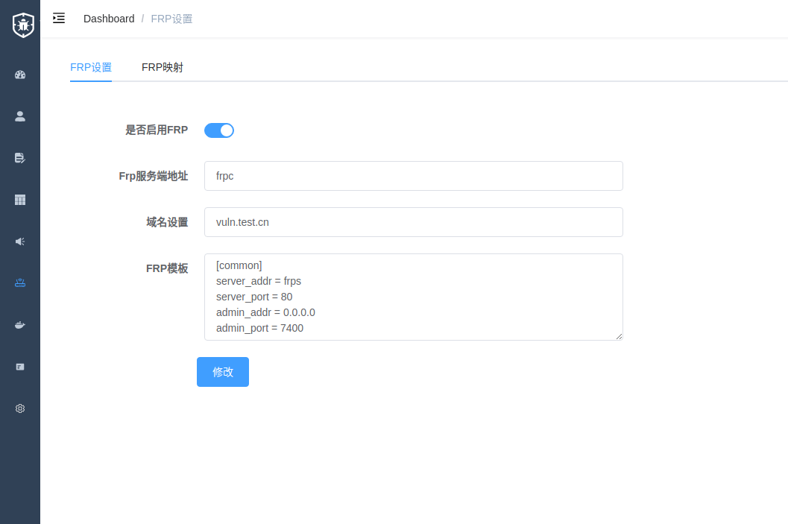

# Vulfocus-frp

## 说明

基于官方原版Vulfocus系统进行修改，添加FRP穿透功能，可通过后台FRP相关设置以及修改部分配置文件即可实现通过绑定子域名的方式进行访问

## 使用说明

- 修改文件`./frp/frps.ini`

```ini
token = random_this # change me
ubdomain_host = vuln.test.cn # change me
```

---
- 修改文件`./vulfocus-api/default`

```shell
location / {
		# First attempt to serve request as file, then
		# as directory, then fall back to displaying a 404.
		resolver 127.0.0.11;
		proxy_set_header    Host    $host;
		if ( $host ~* (.*)\.vuln\.test\.cn ) {
		    set $domain $1;
		    set $url http://frps$request_uri;
		    proxy_pass  $url;
		}
		try_files $uri $uri/ =404;
	}
```

将其中的`vuln\.test\.cn`修改为所需要的域名即可，例如`\.frp\.example\.cn`

---
- 修改文件`./docker-compose.yml`

```yaml
  frps:
    image: vul-frp
#    build: ./frp
    ...

  frpc:
    image: vul-frp
#    build: ./frp
    ...
```
第一次启动时将`build: ./frp`命令的注释取消

---
- 后台配置

在FRP设置中，手动添加需要解析到的域名，例如`vuln.test.cn`



## 致谢

Vulfocus官网：[https://fofapro.github.io/vulfocus/](https://fofapro.github.io/vulfocus/)

H1ve：[https://github.com/D0g3-Lab/H1ve](https://github.com/D0g3-Lab/H1ve)

FRP：[https://github.com/fatedier/frp](https://github.com/fatedier/frp)